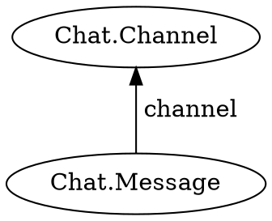
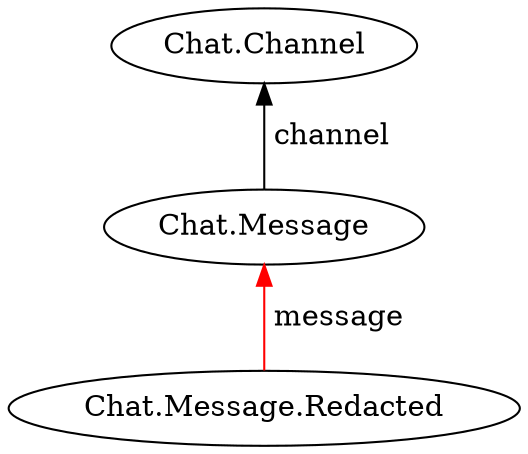

Receive notification when a fact is added or removed from query results.
The notification function will initially receive all matching facts.
It will then subsequently receive new facts as they are created.

```typescript
watch<T, U, V>(
    start: T,
    preposition: Preposition<T, U>,
    resultAdded: (result: U) => V,
    resultRemoved: (model: V) => void
): Watch<U, V>;
```

## Parameters

* **start** - A fact from which to begin the query
* **preposition** - A [preposition](../../preposition/) describing the facts to match
* **resultAdded** - A function that is called when a fact is added
* **resultRemoved** (optional) - A function that is called when a fact is removed

## Returns

* A `Watch` object that can be used to nest new watches or stop watching

## Syntax

```pikchr
//========== COMMON SETUP ===============

scale = 1.0
$r = 0.2in
linerad = 0.75*$r  //rouding of lines
linewid = 0.15  //length of lines
Z:box invisible

//========== Watch ====================

move down 175%
move left until even with Z.w
right

box "watch:" big bold fit thick
move down 100%
move left until even with Z.w
right

circle wid 10%
arrow right 200%
oval "j.watch" fit
arrow
oval "(" fit
arrow
box "starterFact" italic fit
arrow
oval "," fit
arrow
box "preposition" bold italic fit fill 0x8dd3c7
arrow
oval "," fit
arrow
box "resultAdded" italic fit
arrow
oval "," fit
arrow
box "resultRemoved" italic fit
arrow
oval ")" fit
arrow 200%
circle wid 10%
```

See [preposition](../../preposition/)

[Full diagram](../../preposition/syntax-diagram/)

## Examples

Watch for new facts.
Display them to the user as they arrive.



```typescript
function displayMessage(m) {
    // Update the user interface
}

function messagesInChannel(c) {
    return j.match({
        type: 'Chat.Message',
        channel: c
    });
}

j.watch(channel, j.for(messagesInChannel), displayMessage);
```

Remove facts that no longer match the query.
This will occur if the template function has a condition that later becomes false.
The `resultAdded` function must return a value.
This value will be pased to `resultRemoved` when the condition changes.



```typescript
function displayMessage(m) {
    // Update the user interface
    return domElement;
}

function removeMessage(domElement) {
    // Remove the message from the user interface
}

function messagesInChannel(c) {
    return j.match({
        type: 'Chat.Message',
        channel: c
    }).suchThat(j.not(messageIsRedacted));
}

function messageIsRedacted(m) {
    return j.exists({
        type: 'Chat.Message.Redacted',
        message: m
    });
}

j.watch(channel, j.for(messagesInChannel), displayMessage, removeMessage);
```