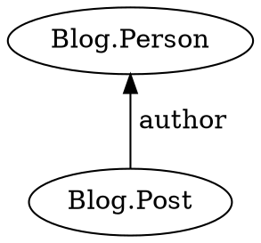
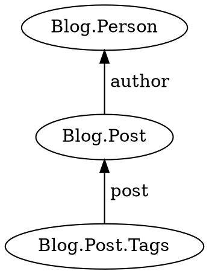

Prepare a template function to be used in [`query`](../../jinaga/query/) or [`watch`](../../jinaga/watch/).

```typescript
static for<T, U>(
    specification: (target: T) => Specification<U>
): Preposition<T, U>;
```

## Parameters

* **specification** - A template function, which returns [`j.match`](../match/)

## Returns

* A [preposition](../) that can be passed to `query` or `watch`, or used to construct a preposition chain

## Syntax

```pikchr
//========== COMMON SETUP ===============

scale = 1.0
$r = 0.2in
linerad = 0.75*$r  //rouding of lines
linewid = 0.15  //length of lines
Z:box invisible

//========== Preposition ====================
move down 100%
move left until even with Z.w
right

circle wid 10%
arrow right 200%
A:oval "j.for" fit
arrow 200%
oval "(" fit
arrow

D:[
text "Function that returns a" italic
box "specification" italic bold fit fill 0xffffb3 with n at last.s
]
Border: box width D.width height D.height*1.3 at D.c

arrow
B:oval ")" fit
arrow 300%
circle wid 10%
arrow right from B.e then down then left
C: [text "then"
move -charwid
text " ." bold]
oval width C.width height C.height at C.center
arrow left 200%
arrow left until even with A.e + (0.15,0) then up then right
```

See [specification](../specification/)

[Full diagram](../)

## Examples

Prepare a template function for `query`.



```typescript
function postsByAuthor(a) {
    return j.match({
        type: 'Blog.Post',
        author: a
    });
}

const posts = await j.query(person, j.for(postsByAuthor));
```

Build a preposition chain.



```typescript
function tagsForPost(p) {
    return j.match({
        type: 'Blog.Post.Tags',
        post: p
    });
}

const tags = await j.query(person, j
    .for(postsByAuthor)
    .then(tagsForPost));
```