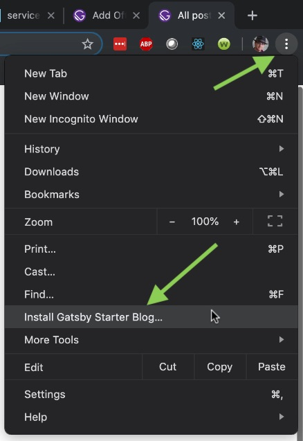

# Your First PWA

A workshop for building your first PWA.
Build a PWA using Gatsby.
Build another using Workbox.
And finally, build one using Jinaga.

## Gatsby

At first glance, Gatsby is a static site generator.
It turns markdown into web pages, and serves them from a static CDN.
But look behind the scenes, and Gatsby is so much more.
It's an ecosystem of plugins.
It's an application framework.
And it's a great way to get started writing your first PWA.

You can find the full instructions on [getting started with Gatsby](https://www.gatsbyjs.org/docs/).
What we will step through here is an abbreviated version designed to get your first PWA running.

### Node JS

To begin, you should be running [Node JS](https://nodejs.org/en/).
If you are on MacOS, use the Terminal window.
If you are on Windows, I recommend using [Windows Subsystem for Linux](https://docs.microsoft.com/en-us/windows/wsl/install-win10).

To make sure that Node is working, go to the Bash command line and run:

```bash
node -v
```

You should see something like `v10.15.3`.
Version 8 or later fine.

### Gatsby CLI

Go to your personal development directory (mine is `/Projects`, but yours might be `/Users/yourname/Projects`).
Initialize a new Gatsby project (I called mine `gatsbypwa`).
This will create a new folder.

```bash
cd /Projects
npx gatsby new gatsbypwa https://github.com/gatsbyjs/gatsby-starter-blog
cd gatsbypwa
```

### Start Editing

Open your favorite text editor and start modifying the application.
Start with the `content` folder, where you will find blog posts.
Spin up a development server, and see that changes apply as soon as you save them.
Cool, huh?

```bash
code .
npm start
```

The application will start at http://localhost:8000.

### Manifest and Offline Plugins

That's really cool and all, but what about Progressive Web Apps?
When Gatsby runs as a PWA, your visitors can take your content offline.
But you need to set that up.
Fortunately, there's a plugin (or two) for that.
[Full instructions](https://www.gatsbyjs.org/docs/add-offline-support-with-a-service-worker/) are in the Gatsby documentation, but here's the gist of it.

The two plugins that make a Gatsby site a PWA are `gatsby-plugin-manifest` and `gatsby-plugin-offline`.
Look for these declared in `gatsby-config.js`.
They set up a Web Manifest, and install a Service Worker, respectively.
But they only work in a production build.

```bash
npm run build
npx gatsby serve
```

This will start the server at http://localhost:9000/.
Navigate to that page, and click the ellipses in the upper-right corner of the Chrome window.
Then click "Install Gatsby Starter Blog".



## Workbox

## Jinaga
