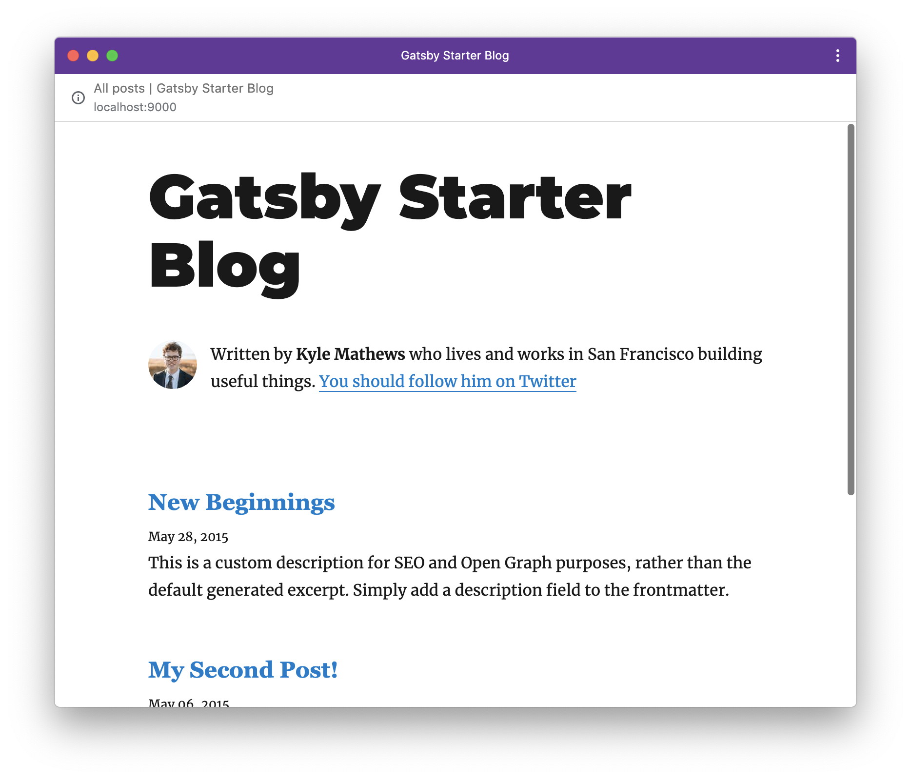

That's really cool and all, but what about Progressive Web Apps?
When Gatsby runs as a PWA, your visitors can take your content offline.
But you need to set that up.
Fortunately, there's a plugin (or two) for that.
[Full instructions](https://www.gatsbyjs.org/docs/add-offline-support-with-a-service-worker/) are in the Gatsby documentation, but here's the gist of it.

## Manifest and Offline Plugins

The two plugins that make a Gatsby site a PWA are `gatsby-plugin-manifest` and `gatsby-plugin-offline`.
Look for these declared in `gatsby-config.js`.
They set up a Web Manifest, and install a Service Worker, respectively.
But they only work in a production build.

```bash
npm run build
npx gatsby serve
```

This will start the server at http://localhost:9000/.
Navigate there with your browser to take a look at some of these artifacts.
Click on one of the blog articles so that it loads some content.
And then open the Chrome dev tools (⌥ + ⌘ + I on a Mac, or F12 on Windows) and open the *Application* tab.
Click on *Manifest* in the sidebar.


The app manifest tells the browser how to install the site as a stand-alone application.
It includes the title, color, icon, and most importantly the *Service Worker*.


The service worker is a bit of JavaScript code that runs in a separate sandbox from the front-end application.
The service worker is installed in the browser, and started up whenever the user navigates to its URL.
It then intercepts network requests.
This makes your application work even when it is offline.
Switch to the *Network* tab, check the "Offline" box, and refresh the page to see this in action.


The Gatsby service worker is programmed to first try to load the page from the server.
If that fails, then it serves up the cached content from *Cache Storage*.
Back on the *Application* tab, you can scan through the cached content.
Notice that this includes HTML, JavaScript, CSS, and any other file that the browser needs to download.


The Gatsby plugin precaches all of the assets needed to run the application, and all of the content that the user has visited.
It even navigates one page away from the visited content and precaches pages they haven't yet loaded.
Go offline and see if you can find some content that was not precached.
(Hint: it might be a *part* of a page that you haven't first visited.)

## Install as Application

Now that you've seen the manifest and service worker, let's see what they do for you.
Click the ellipses in the upper-right corner of the Chrome window.
Then click "Install Gatsby Starter Blog".


This will install the application in Chrome Web Apps on MacOS, or on the Desktop in Windows.
Double-click to launch this application.
It appears to run outside of the browser.
In fact, it is still running in the browser, but it is configured to use minimal UI chrome.



Stop the application server.
Now the application can't connect to load its content.
But that's OK.
It's running the service worker and loading content from the cache.
You can stop the application, restart it, and navigate through content.
