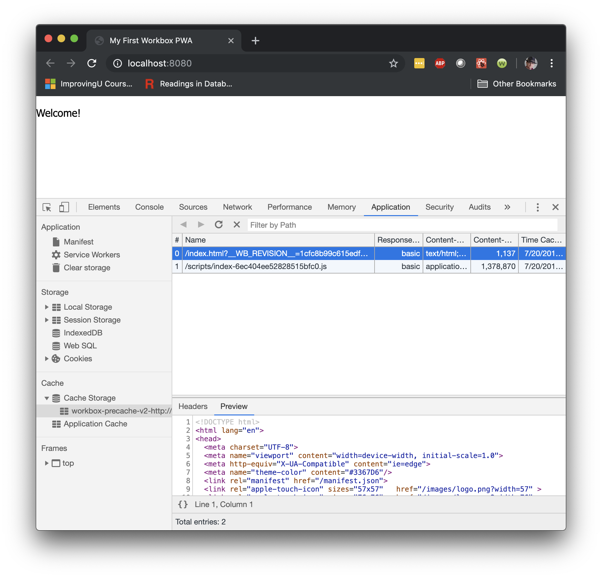

The application is very welcoming.
Other than that, though, its behavior is mostly hidden.
We can explore it in the Chrome dev tools.
Open them up again (⌥ + ⌘ + I on a Mac, or F12 on Windows) and go to the *Application* tab.

## Precache

Under the *Cache* heading, expand *Cache Storage* and take a look at the two files in cache.
One is `index.html`, and the other is a JavaScript bundle.



This is what Workbox does for us.
It pre-caches the assets used by our front-end application.
It then generates a service worker that serves them from cache when the browser requests them.

## Service Worker

The generated service worker is in service-worker.js.
You can inspect this file by first clicking on the *Service Worker* item in the sidebar, then clicking on the service.worker.js link.


This file is pretty big.
That's because it inlines Workbox.
If you scroll all the way to the bottom, you'll see the important bits.

The last thing in the file is the precache manifest.
This is a list of all of the files that make up your application.
The Workbox plugin for Webpack produced this list from the chunks that Webpack built.
They include revision information so that each version has its own distinct cache entry.

```javascript
/**
 * The precacheAndRoute() method efficiently caches and responds to
 * requests for URLs in the manifest.
 * See https://goo.gl/S9QRab
 */

precacheAndRoute([{
  "url": "/index.html",
  "revision": "8433a7bcffd06b9a856a09e973b970bb"
}, {
  "url": "/scripts/index-1f3321d540a29bdb3907.js",
  "revision": "ee09fecc72f7e3572b27bad9dc104e72"
}], {});
```

Scroll up just a little bit and you will see an important event listener.
This listens for `SKIP_WAITING` messages to be raised from the front end.

```javascript
/**
* Welcome to your Workbox-powered service worker!
*
* You'll need to register this file in your web app.
* See https://goo.gl/nhQhGp
*
* The rest of the code is auto-generated. Please don't update this file
* directly; instead, make changes to your Workbox build configuration
* and re-run your build process.
* See https://goo.gl/2aRDsh
*/

self.addEventListener('message', event => {
  if (event.data && event.data.type === 'SKIP_WAITING') {
    self.skipWaiting();
  }
});
```

Each service worker is going to serve up its own precached content, so one service worker is associated with one version of your application.
After your application starts, the browser will download and initialize the latest version.
The new version will be ready as soon as the precached content is downloaded, but it will be in the waiting state.
You can raise the `SKIP_WAITING` message when the user chooses to upgrade to the latest version of your application.

The `precacheAndRoute` function fetches all of the assets from the server and puts them into *Cache Storage*.
It then intercepts all calls from the browser for those URLs, and serves them from the cache.

Now let's see how these HTML and JavaScript files came to be.
