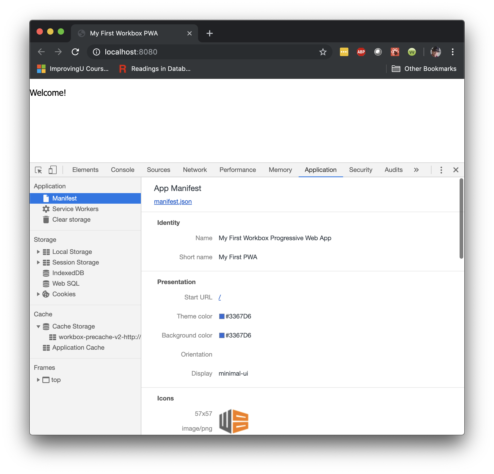

In the Gatsby example, we used a plugin to generate the manifest.
Now, we are responsible for writing it ourselves.
Fortunately, it's pretty simple.
The full documentation of the [Web App Manifest](https://developer.mozilla.org/en-US/docs/Web/Manifest) file is on MDN.

Our simple manifest file is in `manifest.js`.
We serve it up from a simple route:

```javascript
import {manifest} from './manifest';

app.get('/manifest.json', (req, res) => {
  res
    .header('Content-Type', 'application/json')
    .send(JSON.stringify(manifest));
});
```

You can see how the browser interprets the manifest file in the *Application* tab.



Modify the manifest file and refresh the page to see your changes reflected here.
Once you have the manifest the way you like it, you can install the application as you did before.
