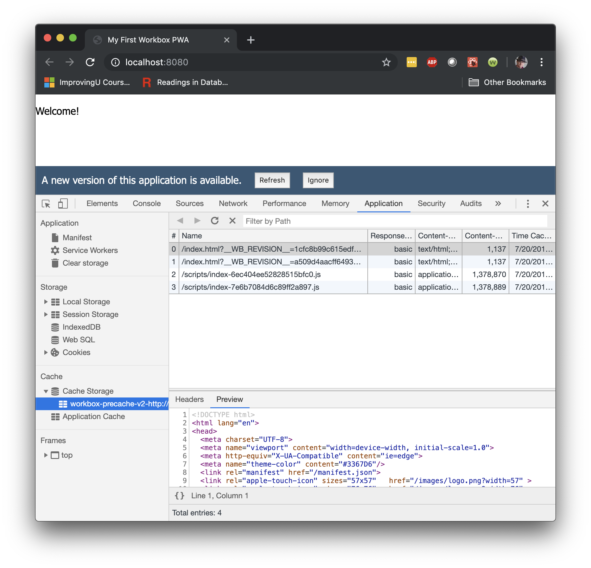

Service workers have some strange behavior that doesn't make much sense right at first.
However, once you think about it a bit longer, it starts to make sense.
It's the way that a service worker responds to the refresh button.

To see this strange behavior, make a change to the application in `app.jsx`.
You can simply change the Welcome message.
Save the change and watch as Webpack rebuilds the application.
If you don't have Webpack running, then execute `npm run dev` again to get it started.

Now switch back to the browser and refresh the page.
You might expect to see the new Welcome message.
But instead, you will still see the old message.
After a brief pause, you will see a bar show up at the bottom of the page.
Don't click this quite yet.

## What just happened?

If you switch to the *Application* tab and look at *Service Workers*, you will see that you now have *two* service workers in your list.


Open the *Cache Storage* and you will see two HTML files and two JavaScript bundles.



The cache contains both the old version and the new version of the app.
And two versions of the service worker have been loaded.
Only one of them is activated, while the other is waiting.

The browser can only send network requests to one version of a service worker at a time.
It doesn't matter how many tabs are open, every tab is using the same version of the service worker.
That service worker is listening for requests from the browser and serving assets from the cache.
A specific version of the service worker is tied to specific cache entries, including the Welcome message.

Once the service worker stops running, the browser can activate the one that is waiting.
At that point, it will start listening for fetch requests.
You can't stop a service worker from running by refreshing the page -- the service worker is running in the background and is not controlled by the page lifecycle.
Besides, serving up the page is what the service worker is *for*.
The service worker will stop when the browser closes.

Close the browser, then start it back up again.
Now you will see your updated Welcome message.
There will be only one service worker loaded, and there will only be two files in the cache.

## Skip Waiting

That's a pretty heavy-handed way to update the application.
Fortunately, we have another tool.
Make another change and refresh the page so we are back to having a waiting service worker.
Then, go back to the *Application* tab and the *Service Workers* screen.
Click on the `skipWaiting` link next to the second service worker.
The first service worker will be stopped and the second will be activated.
You will also see the page refresh, and the Welcome message will change.

The `skipWaiting` function is available for us to call ourselves.
It has to be called by the new service worker, which is running but not receiving any fetch requests.
And that is the reason for the event listener that we saw before:

```javascript
self.addEventListener('message', (event) => {
  if (event.data && event.data.type === 'SKIP_WAITING') {
    self.skipWaiting();
  }
});
```

If you send a `SKIP_WAITING` event to the new service worker, it will stop waiting for the old one to shut down.
You can send the event from the front end.

```javascript
if (reg.waiting) {
  reg.waiting.postMessage({ type: 'SKIP_WAITING' });
}
```

The `reg` above is the service worker registration object.
This code looks for a waiting service worker, and then posts the `SKIP_WAITING` message to it.
This gets called whenever the user clicks the *Refresh* button on the bar.
The code in `register-service-worker.js` sets this all up.
It even refreshes the page when a new service worker (called a *controller* in the event below) becomes active.

```javascript
let refreshing = false;
navigator.serviceWorker.addEventListener('controllerchange',
  () => {
    if (refreshing) return;
    refreshing = true;
    window.location.reload();
  }
);
```

For more information on how this pattern works, please see this [Redfin Engineering post by Dan Fabulich](https://redfin.engineering/how-to-fix-the-refresh-button-when-using-service-workers-a8e27af6df68).
